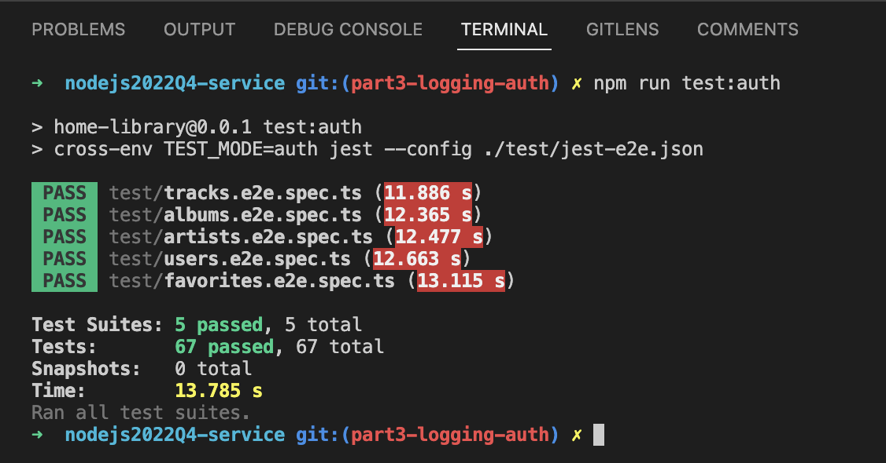
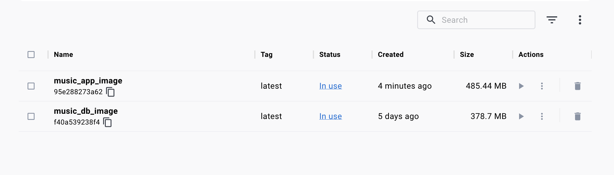
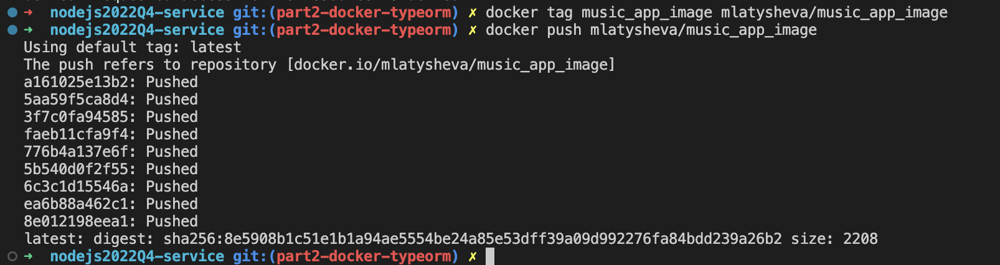
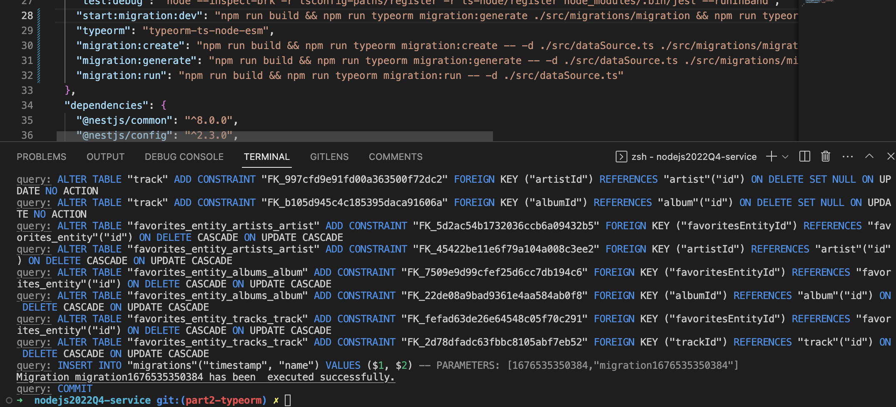

# Home Library Service

This is a Nestjs RESTful music library application that can do the following:
- create and update a user
- create, update and delete a track, get a single track by id and get all tracks
- create, update and delete an artist, get a single artist by id and get all artists
- create, update and delete an album, get a single album by id and get all albums
- add, update and delete a track, artist or album to/from the user's favorites
- signup and login a user by issuing a token and a refresh token
- refresh the token pair
- log errors, warning and messages with a custom logger
- use a custom exception filter
- use a JWT strategy to issue and validate tokens
- store user passwords as hashed passwords using `bcrypt` library

In the second part I added `Docker` to deploy the app and the database that will be used to store the information.
The database is a `postgres` database and `Typeorm` ORM tool is used to create relations and manipulate the data in the database from the app.

In the third part I added a Custom Logger, a Database Logger and an Exception Filter to log messages and errors. As well as implemented a JWT strategy based on `Passport` library to issue and validate tokens and refresh tokens

## The stack used
- Docker
- Postgresql
- Typeorm
- Nestjs
- Passport
- bcrypt
- Typescript
- Eslint/Prettier
- Swagger

## Downloading, Installing and Running the App

- Clone the repository by running `git clone https://github.com/mlatysheva/nodejs2022Q4-service.git`
- On your local machine `cd` into the folder with the cloned repository
- Install all NPM dependencies by running `npm i` from the command line
- Rename the file `.env.example` into `.env`
- Launch `Docker` by running `npm run docker:build`
- The following commands are available to work with the docker: 
  - `npm run docker:start` to start the containers
  - `npm run docker:stop` to stop the containers
  - `npm run docker:test` to run the e2e tests inside the docker
  - `npm run docker:scan:app` to scan the application for vulnerabilities
  - `npm run docker:scan:db` to scan the database for vulnerabilities
  - `npm run docker:scan` to scan both the database and the app for vulnerabilities

- The application is running by default on port 4000
- The postgres database is running by default on port 5432
- Once the application is running, you can make CRUD requests to the relevant endpoints

- There is a swagger file showing available endpoints and required request body and response body at http://localhost:4000/doc/

## Testing

Once the application and database are running inside relevant Docker containers, run the tests for an authorised user by:

- `npm run test:auth`

- The image of the application is 485 Mb

- There is a `user-defined bridge`
- The app container restarts after crashing
- Upon changes in the local `src` folder, the app launched in the docker container restarts
- The built image has been pushed to Docker Hub at https://hub.docker.com/repository/docker/mlatysheva/music_app_image/general

- Migrations are used to create database entities

- The following scripts may be used to run migrations:
  - `npm run migration:generate` - to generate migrations
  - `npm run migration:run` - to run migrations
- Migrations are incoporated into the docker app when the app image is being built
