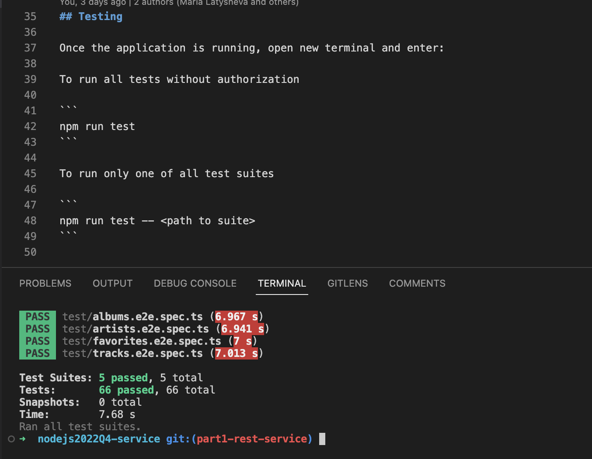
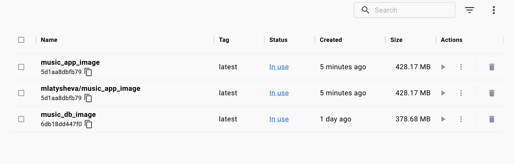

# Home Library Service

This is a Nestjs RESTful music library application that can do the following:
- create and update a user
- create, update and delete a track, get a single track by id and get all tracks
- create, update and delete an artist, get a single artist by id and get all artists
- create, update and delete an album, get a single album by id and get all albums
- add, update and delete a track, artist or album to/from the user's favorites

In the second part I added docker where I deployed the app and the database that will be used to store the information

## The stack used
- Docker
- Postgresql
- Nestjs
- Typescript
- Eslint/Prettier
- Swagger

## Downloading, Installing and Running the App

- Clone the repository by running `git clone https://github.com/mlatysheva/nodejs2022Q4-service.git`
- On your local machine `cd` to the folder with the cloned repository
- Install all NPM dependencies by running `npm i` from the command line
- Rename the file `.env.example` into `.env`
- The application has two modes of running: development and production
- Run `npm run start` to run the application in the production mode
- Run `npm run start:dev` to run the application in the development mode
- Once the application is running, you can make CRUD requests to the relevant endpoints
- There is a swagger file showing available endpoints and required request body and response body.


After starting the app on port (4000 as default) you can open in your browser OpenAPI documentation by typing http://localhost:4000/doc/


- To deploy the app and the database to docker, run `npm run docker:build`
- Run `npm run docker:stop` to stop the containers
- Run `npm run docker:start` to start the containers
- Run `npm run docker:test` to run the e2e tests inside the docker
- Run `npm run docker:scan:app` to scan the application for vulnerabilities
- Run `npm run docker:scan:db` to scan the database for vulnerabilities

- The application is running on port 4000
- The postgres database is running on port 5432

## Testing

### Running the tests on the local machine

Once the application is running, open new terminal and enter:
To run all tests without authorization

```
npm run test
```

To run only one of all test suites

```
npm run test -- <path to suite>
```


### Running the tests inside the docker

- Run `npm run docker:test` to run the e2e tests inside the docker




- The image of the application is 428 Mb
- There is a `user-defined bridge`
- The app container restarts after crashing
- Upon changes in the local `src` folder, the app launched in the docker container restarts
- The built image has been pushed to Docker Hub at https://hub.docker.com/repository/docker/mlatysheva/music_app_image/general


