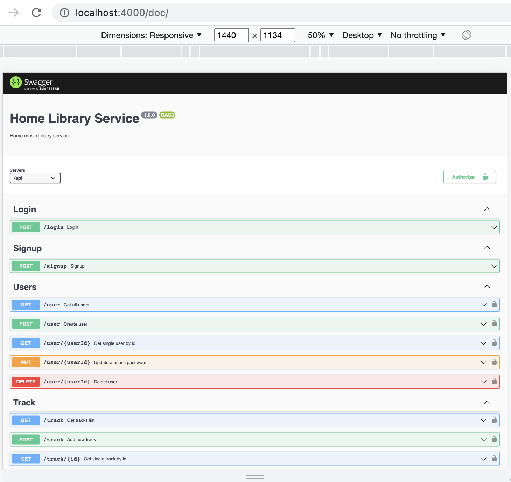
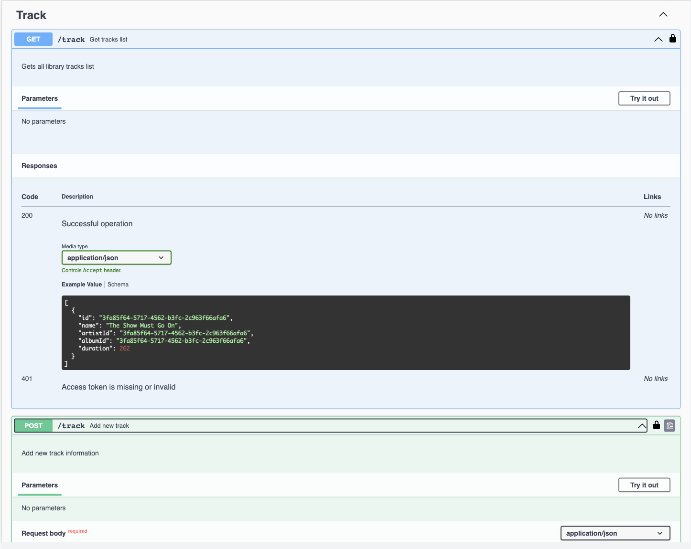
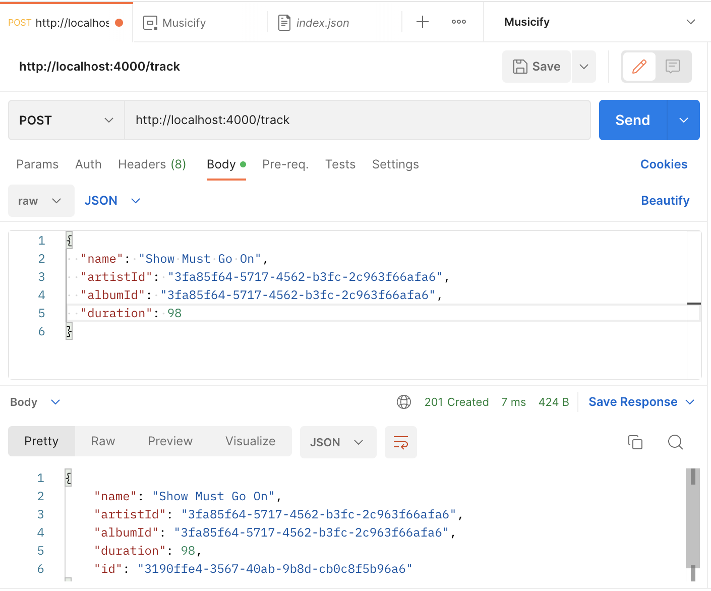

# Home Library Service

This is a Nestjs RESTful music library application that can do the following:
- create and update a user
- create, update and delete a track, get a single track by id and get all tracks
- create, update and delete an artist, get a single artist by id and get all artists
- create, update and delete an album, get a single album by id and get all albums
- add, update and delete a track, artist or album to/from the user's favorites

## The stack used
- Node.js
- Nest.js
- Typescript
- Eslint/Prettier
- Swagger
## Downloading, Installing and Running the App

- Clone the repository by running `git clone https://github.com/mlatysheva/nodejs2022Q4-service.git`
- On your local machine `cd` to the folder with the cloned repository
- Install all NPM dependencies by running `npm i` from the command line
- Rename the file `.env.example` into `.env`
- The application has two modes of running: development and production
- Run `npm run start` to run the application in the production mode
- Run `npm run start:dev` to run the application in the development mode
- Once the application is running, you can make CRUD requests to the relevant endpoints
- There is a swagger file showing available endpoints and required request body and response body.

[]
[]


After starting the app on port (4000 as default) you can open in your browser OpenAPI documentation by typing http://localhost:4000/doc/

[]
## Testing

Once the application is running, open new terminal and enter:

To run all tests without authorization

```
npm run test
```

To run only one of all test suites

```
npm run test -- <path to suite>
```
